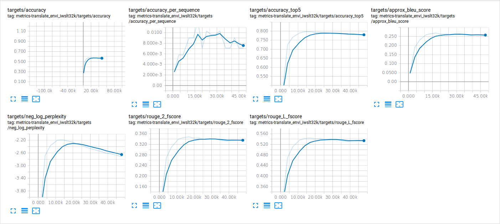

# Neural Machine Translation system for English to Vietnamese

This repository contains all data and documentation for building a neural
machine translation system for English to Vietnamese.

# Dataset

The *IWSLT'15 English-Vietnamese* data is used from [Stanford NLP group](https://nlp.stanford.edu/projects/nmt/).

For all experiments the corpus was split into training, development and test set:

| Data set    | Sentences | Download
| ----------- | --------- | ---------------------------------------------------------------------------------------------------------------------------------
| Training    | 133,317   | via [GitHub](https://github.com/stefan-it/nmt-en-vi/raw/master/data/train-en-vi.tgz) or located in `data/train-en-vi.tgz`
| Development |   1,553   | via [GitHub](https://github.com/stefan-it/nmt-en-vi/raw/master/data/dev-2012-en-vi.tgz) or located in `data/dev-2012-en-vi.tgz`
| Test        |   1,268   | via [GitHub](https://github.com/stefan-it/nmt-en-vi/raw/master/data/test-2013-en-vi.tgz) or located in `data/test-2013-en-vi.tgz`

# *tensor2tensor* - Transformer

A NMT system for English-Vietnamese is built with the [*tensor2tensor*](https://github.com/tensorflow/tensor2tensor)
library. This problem was officially added with [this pull request](https://github.com/tensorflow/tensor2tensor/pull/611).

## Training (Transformer base)

The following training steps are tested with *tensor2tensor* in version *1.5.2*.

First, we create the initial directory structure:

```bash
mkdir -p t2t_data t2t_datagen t2t_train t2t_output
```

In the next step, the training and development datasets are downloaded and
prepared:

```bash
t2t-datagen --data_dir=t2t_data --tmp_dir=t2t_datagen/ --problem=translate_envi_iwslt32k
```

Then the training step can be started:

```bash
t2t-trainer --data_dir=t2t_data --problems=translate_envi_iwslt32k --model=transformer --hparams_set=transformer_base --output_dir=t2t_output
```

The number of GPUs used for training can be specified with the `--worker_gpu`
option.

## Decoding

In the next step, the test dataset is downloaded and extracted:

```bash
wget "https://github.com/stefan-it/nmt-en-vi/raw/master/data/test-2013-en-vi.tgz"
tar -xzf test-2013-en-vi.tgz
```

Then the decoding step for the test dataset can be started:

```bash
t2t-decoder --data_dir=t2t_data --problems=translate_envi_iwslt32k \
--model=transformer --decode_hparams="beam_size=4,alpha=0.6"
--decode_from_file=tst2013.en --decode_to_file=system.output
--hparams_set=transformer_base --output_dir=t2t_output/
```

## Calculating the BLEU-score

The BLEU-score can be calculated with the built-in `t2t-bleu` tool:

```bash
t2t-bleu --translation=system.output --reference=tst2013.en
```

## Results

The following results can be achieved using the (normal) Transformer model.

| Model                                                                                                 | BLEU (Beam Search)
| ----------------------------------------------------------------------------------------------------- | ------------------
| [Luong & Manning (2015)](https://nlp.stanford.edu/pubs/luong-manning-iwslt15.pdf)                     | 23.30
| Sequence-to-sequence model with attention                                                             | 26.10
| Neural Phrase-based Machine Translation [Huang et. al. (2017)](https://arxiv.org/abs/1706.05565)      | 27.69
| Neural Phrase-based Machine Translation + LM [Huang et. al. (2017)](https://arxiv.org/abs/1706.05565) | 28.07
| Transformer (Base)                                                                                    | **28.12** (cased)
| Transformer (Base)                                                                                    | **28.97** (uncased)

## *TensorBoard*

The following figure shows some nice graphs from *TensorBoard* for training.



## Pretrained model

To reproduce the reported results, a pretrained model can be downloaded using:

```bash
wget https://schweter.eu/cloud/nmt-en-vi/envi-model.ckpt-125001.tar.xz
```

The pretrained model has a (compressed) filesize of 720M. After the download
process, the archive must be uncompressed with:

```bash
tar -xJf envi-model.ckpt-125001.tar.xz
```

All necessary files are located in the `export` folder.

The pretrained model can be invoked by using the `--checkpoint_path` commandline
argument of the `t2t-decoder` tool. E.g. the complete command for the test
dataset using the pretrained model is:

```bash
t2t-decoder --data_dir=t2t_data --problems=translate_envi_iwslt32k \
--model=transformer --decode_hparams="beam_size=4,alpha=0.6"
--decode_from_file=tst2013.en --decode_to_file=system.output
--hparams_set=transformer_base --checkpoint_path export/model.ckpt-125001
```
